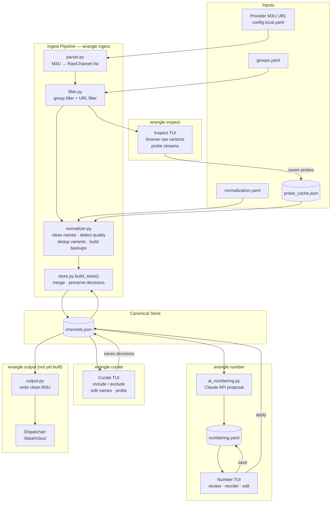

# StreamWrangler — Architecture

```mermaid
flowchart TD
    subgraph inputs["Inputs"]
        URL["Provider M3U URL\nconfig.local.yaml"]
        GROUPS["groups.yaml"]
        NORM_RULES["normalization.yaml"]
        PROBE_CACHE[("probe_cache.json")]
    end

    subgraph pipeline["Ingest Pipeline  —  wrangle ingest"]
        PARSER["parser.py\nM3U → RawChannel list"]
        FILTER["filter.py\ngroup filter + URL filter"]
        NORMALIZER["normalizer.py\nclean names · detect quality\ndedup variants · build backups"]
        BUILD["store.py build_store()\nmerge · preserve decisions"]
    end

    subgraph store["Canonical Store"]
        CHANNELS[("channels.json")]
    end

    subgraph inspect_flow["wrangle inspect"]
        INSPECT["Inspect TUI\nbrowse raw variants\nprobe streams"]
    end

    subgraph curation["wrangle curate"]
        CURATE["Curate TUI\ninclude / exclude\nedit names · probe"]
    end

    subgraph numbering["wrangle number"]
        AI["ai_numbering.py\nClaude API proposal"]
        NUM_YAML[("numbering.yaml")]
        NUM_TUI["Number TUI\nreview · reorder · edit"]
    end

    subgraph output["wrangle output  (not yet built)"]
        OUTPUT["output.py\nwrite clean M3U"]
        DISPATCHARR["Dispatcharr\n/data/m3us/"]
    end

    URL --> PARSER
    PARSER --> FILTER
    GROUPS --> FILTER
    FILTER --> NORMALIZER
    NORM_RULES --> NORMALIZER
    PROBE_CACHE --> NORMALIZER
    NORMALIZER --> BUILD
    CHANNELS --> BUILD
    BUILD --> CHANNELS

    FILTER --> INSPECT
    INSPECT -->|"saves probes"| PROBE_CACHE

    CHANNELS --> CURATE
    CURATE -->|"saves decisions"| CHANNELS

    CHANNELS --> AI
    AI --> NUM_YAML
    NUM_YAML --> NUM_TUI
    NUM_TUI -->|"save"| NUM_YAML
    NUM_TUI -->|"apply"| CHANNELS

    CHANNELS --> OUTPUT
    OUTPUT --> DISPATCHARR
```
